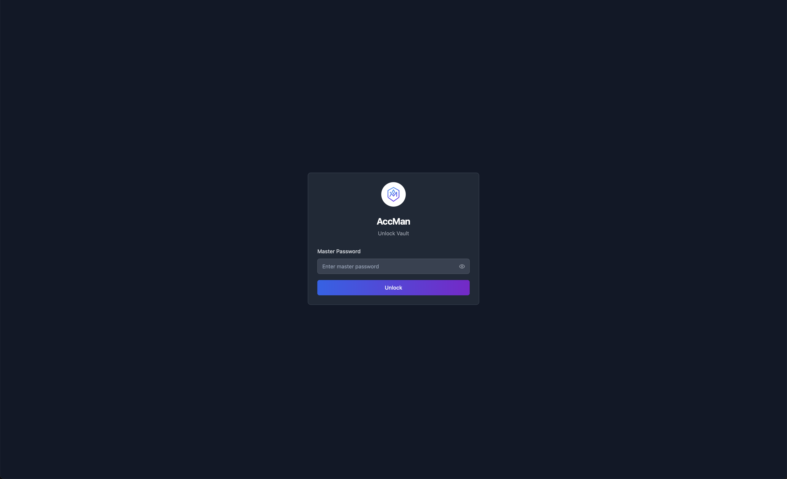
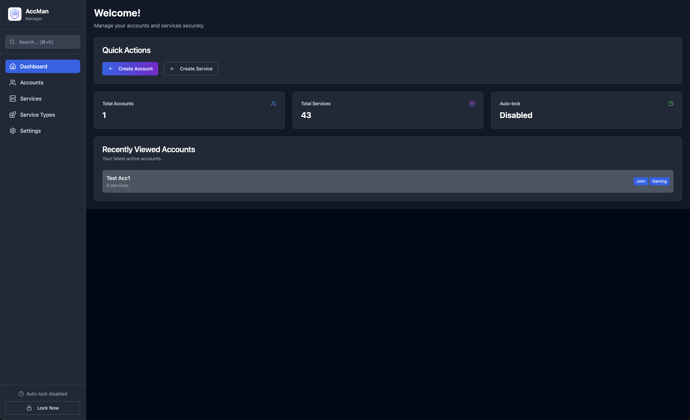
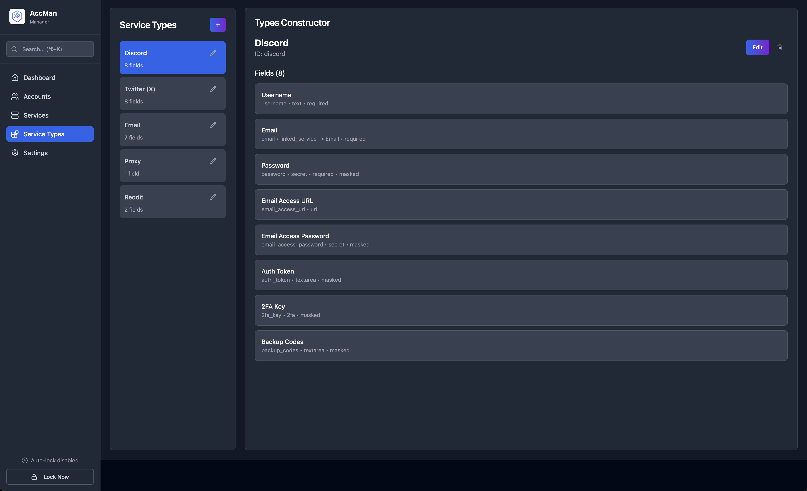
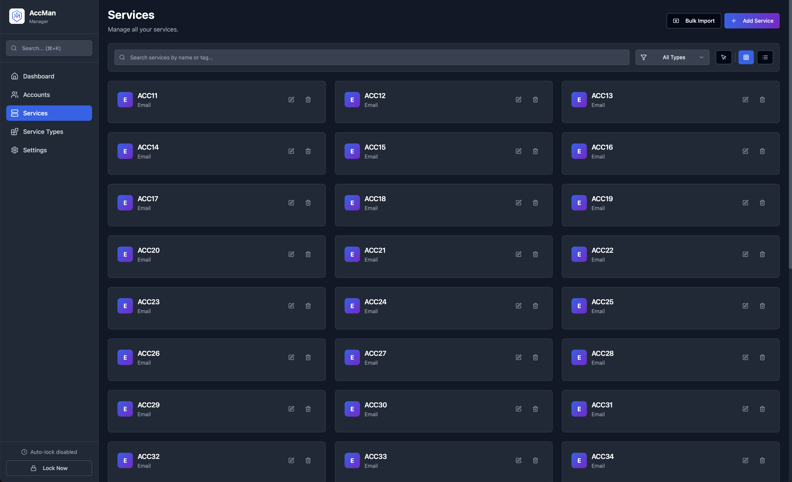
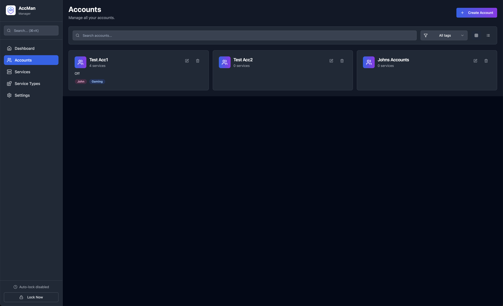

# 🔐 AccMan - Account Manager

<div align="center">
  
  
  **Secure and intuitive desktop application for managing your accounts and services.**
  
  [](https://github.com/romirom11/AccMan/actions/workflows/release.yml)
  [](LICENSE)
  [](https://github.com/romirom11/AccMan/releases)
</div>

## About

AccMan is a secure desktop application for comprehensive account management. Whether you're managing multiple accounts across different services, organizing personal credentials, or handling business accounts, AccMan provides a flexible and secure solution to store, organize, and quickly access all your account data in one encrypted vault.

## 📸 Screenshots

<div align="center">
  










</div>

## ✨ Features

- 🔒 **Secure Local Storage** - All data encrypted and stored locally on your device
- 🎯 **Multi-Account Organization** - Manage dozens of accounts per service efficiently
- 🏷️ **Service Templates** - Create reusable templates for different platforms
- 🔑 **2FA & TOTP Support** - Store 2FA keys and generate TOTP codes instantly
- 🎛️ **Customizable Fields** - Configure custom fields for each service type
- 📥 **Bulk Import/Export** - Import multiple accounts from text files
- 🔍 **Advanced Search** - Quickly find accounts across all services
- 🔗 **Account Linking** - Link multiple services to single accounts
- 🎨 **Clean Interface** - Intuitive UI designed for managing large datasets
- 🌍 **Multi-language** - Available in English and Ukrainian
- 📱 **Cross-Platform** - Works on Windows, macOS, and Linux

## 🚀 Quick Start

### Download

Download the latest version from the [Releases](https://github.com/romirom11/AccMan/releases) page.

### Installation

#### Windows
1. Download the `.msi` installer
2. Run the installer and follow the setup wizard
3. Launch AccMan from the Start Menu

#### macOS
1. Download the `.dmg` file
2. Open the DMG and drag AccMan to Applications
3. Launch AccMan from Applications (you may need to allow it in Security & Privacy settings)

#### Linux
1. Download the `.AppImage` file
2. Make it executable: `chmod +x AccMan.AppImage`
3. Run: `./AccMan.AppImage`

## 🛠️ Development

### Prerequisites

- [Node.js](https://nodejs.org/) (v18 or later)
- [pnpm](https://pnpm.io/) (v9 or later)
- [Rust](https://rustlang.org/) (latest stable)

### Setup

1. **Clone the repository**
   ```bash
   git clone https://github.com/romirom11/AccMan.git
   cd AccMan
   ```

2. **Install dependencies**
   ```bash
   # Install root dependencies (Tauri CLI)
   pnpm install
   
   # Install frontend dependencies
   pnpm --dir src install
   ```

3. **Start development server**
   ```bash
   pnpm tauri dev
   ```

### Build

```bash
# Build for production
pnpm build

# Build Tauri app
pnpm tauri build
```

## 🏗️ Project Structure

```
AccMan/
├── src/                    # Frontend React application
│   ├── components/         # React components
│   ├── pages/             # Application pages
│   ├── hooks/             # Custom React hooks
│   ├── stores/            # State management
│   ├── locales/           # Internationalization files
│   └── api/               # API layer
├── src-tauri/             # Tauri backend (Rust)
│   ├── src/               # Rust source code
│   ├── icons/             # Application icons
│   └── Cargo.toml         # Rust dependencies
└── .github/workflows/     # CI/CD workflows
```

## 🔧 Tech Stack

- **Frontend**: React, TypeScript, Tailwind CSS, Vite
- **Backend**: Rust, Tauri
- **State Management**: Custom stores
- **Styling**: Tailwind CSS, shadcn/ui components
- **Internationalization**: i18next
- **Build Tool**: Vite
- **Package Manager**: pnpm

## 🚧 Roadmap

### Upcoming Features

- 📊 **Account Analytics** - Track usage patterns across your accounts
- 🔄 **Bulk Operations** - Mass edit, delete, or update multiple accounts
- 📋 **Account Templates** - Quick setup for common account types
- 🏷️ **Advanced Tagging** - Better organization with hierarchical tags
- 📱 **Mobile Companion** - View-only mobile app for quick access
- 🔄 **Backup & Restore** - Automated backup solutions
- 🎨 **Themes** - Dark/light mode and custom themes

### In Development

- 🔑 Enhanced 2FA management with QR code scanning
- 🎛️ Advanced field customization with templates
- 📥 Improved import from popular password managers

Want to suggest a feature? [Open an issue](https://github.com/romirom11/AccMan/issues/new?template=feature_request.md) or start a [discussion](https://github.com/romirom11/AccMan/discussions)!

## 🌍 Internationalization

AccMan supports multiple languages:
- 🇺🇸 English
- 🇺🇦 Ukrainian

To add a new language:
1. Create a new folder in `src/locales/`
2. Add translation files
3. Update the i18n configuration

## 🤝 Contributing

We welcome contributions! Please see our [Contributing Guidelines](CONTRIBUTING.md) for details.

1. Fork the repository
2. Create your feature branch (`git checkout -b feature/amazing-feature`)
3. Commit your changes (`git commit -m 'Add some amazing feature'`)
4. Push to the branch (`git push origin feature/amazing-feature`)
5. Open a Pull Request

## 📝 License

This project is licensed under the MIT License - see the [LICENSE](LICENSE) file for details.

## 🙏 Acknowledgments

- [Tauri](https://tauri.app/) - For the amazing framework
- [React](https://reactjs.org/) - For the UI library
- [Tailwind CSS](https://tailwindcss.com/) - For the styling framework
- [shadcn/ui](https://ui.shadcn.com/) - For the beautiful components

## 📞 Support

If you have any questions or need help:
- 🐛 [Report a bug](https://github.com/romirom11/AccMan/issues/new?template=bug_report.md)
- 💡 [Request a feature](https://github.com/romirom11/AccMan/issues/new?template=feature_request.md)
- 💬 [Start a discussion](https://github.com/romirom11/AccMan/discussions)

---

<div align="center">
  Made with ❤️ by romirom11
</div>